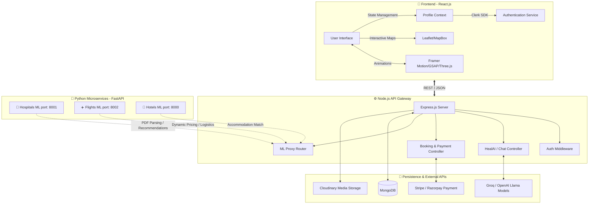

<div align="center">
  
  <br/>
  <h1>🩺 HealTrip</h1>
  <strong>The Ultimate AI-Powered Medical Tourism & Wellness Protocol</strong>
  <br/>
  <br/>

  [](https://reactjs.org/)
  [](https://nodejs.org/)
  [](https://www.python.org/)
  [](https://fastapi.tiangolo.com/)
  [](https://www.mongodb.com/)
  [](https://www.docker.com/)

</div>

## 📖 Overview
HealTrip is a full-stack, AI-driven medical tourism platform designed to bridge the gap between patients and world-class healthcare facilities globally. By combining advanced Machine Learning algorithms, Large Language Models (LLMs), and an intuitive UI, HealTrip provides a seamless end-to-end journey—from initial symptom diagnosis to booking top-rated hospitals, targeted flights, and accommodations.

---

## 🏗️ System Architecture

HealTrip operates on a decoupled microservices-inspired architecture. A centralized Node.js API acts as the gateway, orchestrating traffic between a dynamic React frontend and three independent Python FastAPI ML engines.



---

## ✨ Core Features

### 1. 🤖 HealAI Assistant (Contextual Chatbot)
- **Medical PDF Analysis**: Users can upload their medical reports (PDF). The Hospitals ML service extracts physiological data using NLP to identify active diseases and the required medical specialty.
- **Continuous Session Memory**: Powered by **Groq / OpenAI**, the chatbot maintains context across the user’s journey, intelligently answering questions and automatically updating the user's health profile (Symptoms & History baseline).
  
### 2. 🏥 Automated Hospital Discovery
- **ML Similarity Matching**: Leverages `scikit-learn` and `pandas` in a dedicated Python microservice to rank and match hospitals based on proximity, success rates, user reviews, and specialty matching derived from the AI diagnosis.
- **Dynamic Maps**: Hospital results are visually plotted on interactive Leaflet/Mapbox implementations.

### 3. 🗺️ Guided Journey & Travel Planner
- **6-Step Wizard**: Navigates the user through a frictionless funnel: `Destination -> Hospital -> Flights -> Hotels -> Transport -> Summary`.
- **Integrated ML Logistics**: Connects directly to the Flights and Hotels ML APIs to recommend dynamic travel itineraries optimized by cost and shortest travel duration.

### 4. 💳 Frictionless Bookings
- Unified payment flow combining Stripe and Razorpay integrations to process international and domestic (Indian) currencies seamlessly.

---

## 🛠️ Technology Stack

| Layer | Technologies |
| :--- | :--- |
| **Frontend** | React 19, TailwindCSS, Framer Motion, GSAP, Radix UI, Lucide Icons, Three.js |
| **Backend** | Node.js, Express.js, Mongoose |
| **Microservices** | Python 3.9, FastAPI, Uvicorn, Pandas, Scikit-learn, Numpy |
| **Database** | MongoDB Atlas |
| **Authentication** | Clerk Auth |
| **AI / LLMs** | Groq API, OpenAI API |
| **DevOps** | Docker, Docker Compose |

---

## 🚀 Local Development Setup

### Prerequisites
- Node.js (v18+)
- Python (v3.9+)
- MongoDB Atlas Account / Local Instance

### 1. Clone & Install
```bash
git clone https://github.com/Pratyush426/HealTrip.git
cd HealTrip

# Install Frontend
cd frontend && npm install

# Install Backend
cd ../backend && npm install

# Install ML Dependencies
cd ml/hotels && pip install -r requirements.txt
cd ../hospitals && pip install -r requirements.txt
cd ../flights && pip install -r requirements.txt
```

### 2. Environment Variables
Duplicate `.env.example` in the root and fill in your keys:
```bash
cp .env.example .env
```
Ensure you have added your `CLERK_SECRET_KEY`, `MONGO_URI`, and `OPENAI_API_KEY`/`GROQ_API_KEY`.

### 3. Run the Stack Locally
We have provided a convenient batch script to spin up all Python microservices simultaneously.
```bash
# Terminal 1: Start ML Engines (Windows)
.\start-ml-services.bat

# Terminal 2: Start Node.js Backend
cd backend && npm run dev

# Terminal 3: Start React Frontend
cd frontend && npm start
```

---

## 🐳 Docker Deployment (Production)

The entire project is structured to run effortlessly in the cloud using Docker Compose. The configuration merges the React app into the Node.js server (as static files) and spins up isolated containers for the three ML python services.

**Deploying to a VPS (AWS EC2, DigitalOcean, Hetzner):**
```bash
# 1. Clone the repository on the server
git clone https://github.com/Pratyush426/HealTrip.git
cd HealTrip

# 2. Add your production .env keys
nano .env

# 3. Fire up the orchestration
docker compose up --build -d
```
Your app will be exposed internally, with the gateway available at `http://YOUR_SERVER_IP:5000`.

---

## 📂 Directory Structure
```text
HealTrip/
├── frontend/             # React.js application
│   ├── src/
│   │   ├── components/   # Reusable UI elements & Animations
│   │   ├── pages/        # Route components (Dashboard, JourneyPlanner, HealChat)
│   │   ├── context/      # Zustand / React Context (UserProfileContext)
│   │   └── utils/        # API Request Managers
├── backend/              # Node.js API Gateway
│   ├── src/
│   │   ├── controllers/  # Logic handlers (Chat, Bookings, Auth)
│   │   ├── routes/       # Express route definitions
│   │   ├── models/       # Mongoose schemas
│   │   └── server.js     # Production setup and Static Serving
│   └── ml/               # Python FastAPI Microservices
│       ├── hotels/       
│       ├── hospitals/    
│       └── flights/      
├── docker-compose.yml    # Main orchestration configuration
├── Dockerfile            # Multi-stage build for Node & React
└── .env.example          # Security templates
```

---

<p align="center">
  <i>Built with ❤️ by the HealTrip Team</i>
</p>
